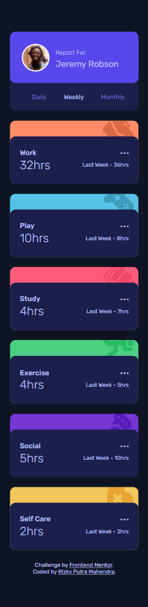
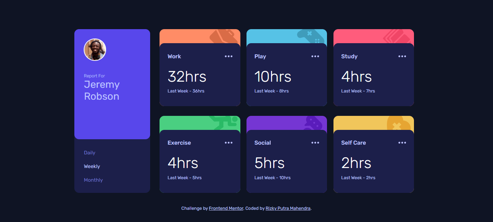

# Frontend Mentor - Time tracking dashboard solution

This is a solution to the [Time tracking dashboard challenge on Frontend Mentor](https://www.frontendmentor.io/challenges/time-tracking-dashboard-UIQ7167Jw). Frontend Mentor challenges help you improve your coding skills by building realistic projects.

## Table of contents

-   [Overview](#overview)
    -   [The challenge](#the-challenge)
    -   [Screenshot](#screenshot)
    -   [Links](#links)
-   [My process](#my-process)
    -   [Built with](#built-with)
    -   [Useful resources](#useful-resources)
-   [Author](#author)

## Overview

### The challenge

Users should be able to:

-   View the optimal layout for the site depending on their device's screen size
-   See hover states for all interactive elements on the page
-   Switch between viewing Daily, Weekly, and Monthly stats

### Screenshot

### Links

-   Solution URL: [Github](https://github.com/rizky-pm/time-tracking-dashboard)
-   Live Site URL: [Github Pages](https://github.com/rizky-pm/time-tracking-dashboard/settings/pages)

## My process

### Built with

-   Semantic HTML5 markup
-   CSS custom properties
-   Flexbox
-   CSS Grid
-   Mobile-first workflow
-   [React](https://reactjs.org/) - JS library
-   [Styled Components](https://styled-components.com/) - For styles

### Useful resources

-   [What Is "Lifting State Up" in React?](https://www.freecodecamp.org/news/what-is-lifting-state-up-in-react/)
-   [Radio button without the dot](https://codepen.io/jacobberglund/pen/AKiBf)
-   [Responsive Sizing With rem CSS Units](https://dev.to/vetswhocode/responsive-sizing-with-rem-css-units-2m27)

## Author

-   Frontend Mentor - [@rizky-pm](https://www.frontendmentor.io/profile/rizky-pm)
-   Twitter - [@\_rizkypm](https://twitter.com/_rizkypm)
